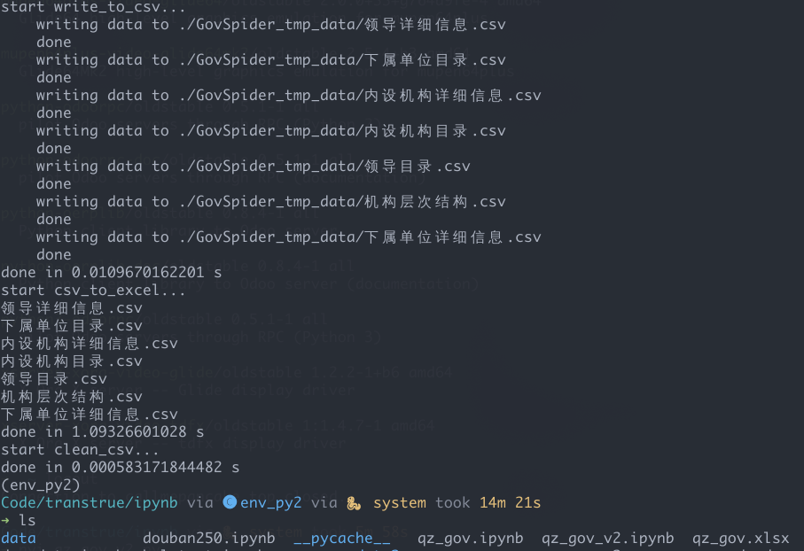

## <center>衢州市政府爬虫</center>

<!--s-->

衢州市政府信息公开网址: http://www.qz.gov.cn/col/col1525479/index.html

页面左侧为目录, 右侧为列表(可翻页)


<!--s-->

### 获取目录中需要的条目


<!--v-->


<!--s-->

* 构建请求 url
```python
url = 'http://www.qz.gov.cn/module/xxgk/search.jsp'
params = {
    divid = 'div1525479',
    i_id = 'A0102',  # 领导信息
    # i_id = 'A0103',  # 内设机构
    # i_id = 'A0104',  # 下属单位
    webid = '3084',
    area = '',
    sortfield = ''
}
```

* 构建请求头(这里只用到 UA)
```python
headers = {
    'User-Agent': 'Mozilla/5.0 (X11; Linux x86_64) AppleWebKit/537.36 (KHTML, like Gecko) Chrome/75.0.3770.142 Safari/537.36'
    'Cookie': 'xxxxxxxxxx'  # Cookie 信息
}
```
<!--s-->

### 获取信息列表中的条目


<!--v-->
找到翻页功能对应的参数是`currpage`
```python
params = {
    divid = 'div1525479',
    i_id = 'A0102',  # 领导信息
    # i_id = 'A0103',  # 内设机构
    # i_id = 'A0104',  # 下属单位
    webid = '3084',
    area = '',
    sortfield = ''
    currpage = 1
}
```

<!--v-->
开始获取每一个条目(这里是其中的一部分代码)
```python
response = requests.get(url, params=params)  # 发送请求
response.encoding = response.apparent_encoding  # 设置编码
soup = BeautifulSoup(response.text, features='lxml')  # 请求结果生成 BeautifulSoup 对象
names_html = soup.find_all(  # 根据条件找到需要的部分
    'a',
    attrs={
        'target': '_blank',
        'style': 'cursor:hand;'
    }
)
```

<!--s-->
### 获取信息列表中点击进入后的详细信息页面中的表单数据

爬取方式类似, 只是过程中发现详细信息的网页不止一种


<!--v-->


<!--v-->
找不同, 这里根据 url 的不同分类, 分别进行网页分析
```python
if url.startswith('http://fgw'):
    ...
elif url.startswith('http://www'):
    ...
else
    ...
```

<!--s-->
### 机构的层级结构

* 原来的数据结构


<!--v-->
* 记录每一条对应关系
```python
for row in self.sub_units:
    unit_dict[row[unit]] = [self.tree_root, sub_unit_type]
    unit_dict[row[sunit]] = [row[unit], sub_unit_type]
    all_unit.add(row[unit])
    all_unit.add(row[sunit])
for row in self.builtin_units:
    unit_dict[row[unit]] = [self.tree_root, builtin_unit_type]
    unit_dict[row[bunit]] = [row[unit], builtin_unit_type]
    all_unit.add(row[unit])
    all_unit.add(row[bunit])
```
<!--v-->
* 按照机构从高往低的顺序, 记录每一条对应关系
```python
while unit_dict:
    tmp_seen = set()
    for unit in all_unit:
        if unit in unit_dict and unit_dict[unit][0] in seen:
            self.unit_tree.append(
                [unit, unit_dict[unit][0], unit_dict[unit][1]]
            )
            unit_dict.pop(unit)
            tmp_seen.add(unit)
    seen |= tmp_seen
```
<!--v-->
* 期望机构层次表


<!--s-->
### 数据存储

* 写入 csv 文件
```python
sep = '\t'  # 分隔符根据需要设置, 有时候爬取下来的内容中本身就包含设定的分隔符
with open(self.path+filename, 'w') as data_file:
    # 先写表头
    data_file.write(sep.join(heads)+'\n')
    for line in data:
        # 写入每行数据
        data_file.write(sep.join(line)+'\n')
```

* 多个 csv 存入 Excel 表格
```python
with pd.ExcelWriter(self.path+excelname) as writer:
    for key, csv_name in self.csv_list.items():
        csv = pd.read_csv(self.path+csv_name, sep=sep, encoding='utf-8')
        csv.to_excel(writer, sheet_name=csv_name)
```
<!--s-->
### 结果显示

* 运行结果

>这里没有爬取到所有页面


<!--v-->
在加入 UA 并且放慢请求频率之后就可以了


<!--v-->

<!--v-->
* 查看数据

<!--v-->
* 机构层次结构


